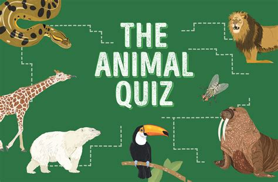

Are you a fan of quizzes? Would you like to make one yourself? In this project, you’ll build an animal quiz. Even though the questions are about animals, this project can be easily modified to be about any other topic.

In this example, you'll see bits of code with annotations. The code in black is new code to be added. The code in grey is existing code; use this to work out where to add the new lines of code. The instructions will ask you to run the code at various points. Make sure you do this and that the code successfully runs. **Do not proceed to the next step until the previous one works. You'll just make things harder for yourself!**


## What happens 
The program asks the player some questions about animals. They get three chances to answer each question—you don’t want to make the quiz too difficult! Each correct answer will score one point. At the end of the quiz, the program reveals the player’s final score.

## How it works 
This project makes use of a function—a block of code with a name that performs a specific task. A function lets you use the same code repeatedly, without having to type it all in every time. Python has lots of built-in functions, but it also lets you create functions of your own.
<--->
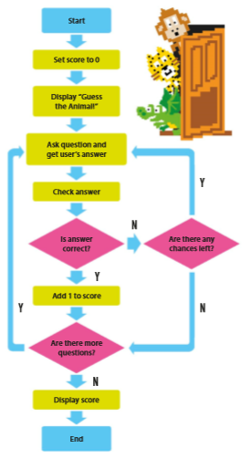

 
## Putting it together
It’s now time to build your quiz! First you’ll create the questions and the mechanism for checking the answers. Then you’ll add the code that gives the player three attempts to answer each question.

## 1. Create A New File
Open Mu Editor. Make sure the editor is in the right mode. Click the **Mode** button in the top left, and choose **Python 3**. Create a new file, and save it with the name `animalQuiz.py` in your Digital Tech folder, in a folder named `quiz`.
 

## 2.Create the score variable 
Type in the code shown here to create a variable called `score` and set its starting value to `0`.

## 3.Introduce the game
Next, create a message to introduce the game to the player. This will be the first thing that the player sees on the screen.

## 4.Run the code
Now try running the code. Press the Run button from the bar at the top. What happens next? You should see the welcome message in the interactive panel at the bottom of the window. Press the Stop button (where the Run button was) to stop the program and return to editing.
<--->
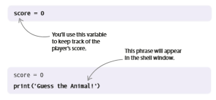



## 5.Ask a question (user input) 
The next line of code asks a question and waits for the player’s response. The answer (the user input) is saved in the variable `guess1`. Run the code to make sure the question appears.
<--->
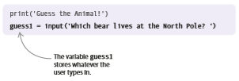



## 6.Build a check function 
The next task is to check if the player’s guess is correct. Type this code at the top of your script, before `score = 0`. The code creates a function, called `check_guess()`, that will check if the player’s guess matches the correct answer. The two words in brackets are **[parameters]()**—bits of information the function needs. When you call (run) a function, you assign (give) values, known as **[arguments]()**, to its parameters.
<--->
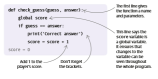



## 7.Call the function 
Now add a line at the end of the script to call (run) the check_guess() function. This code tells the function to use the player’s guess as the first parameter and the phrase “polar bear” as the second parameter.
<--->
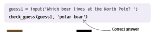



## 8.Test the code 
Try running the code again and type in the correct answer. The shell window should look like this.
<--->
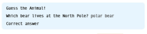



## 9.Add some more questions
It takes more than one question to make a quiz! Add two more questions to the program, following the same steps as before. We’ll store the player’s answers in the variables `guess2` and `guess3`.
<--->
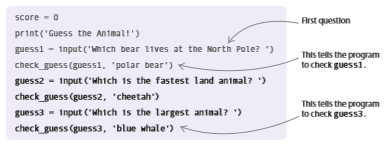



## 10.Display the score
The next line of code will reveal the player’s score in a message when the quiz ends. Add it to the bottom of the file, under the last question.
<--->
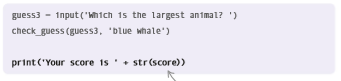



## 11. Ignore case
What happens if the player types “Lion” instead of “lion”? Will they still get a point? No, the code will tell them it’s the wrong answer! To fix this, you need to make your code smarter. Python has a `lower()` function, which changes words into all lower-case characters. In your code, replace `if guess == answer:` with the line shown on the right in bold.
<--->
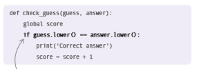



## 12. Test the code again
Run your code for a third time. Try typing the correct answers using a mixture of capitals and lower-case letters and see what happens.
<--->
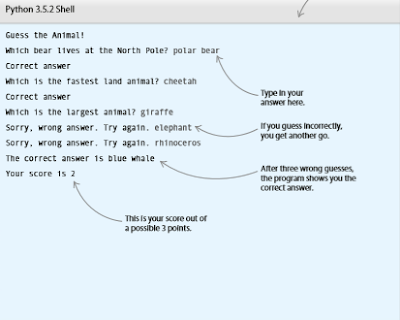

