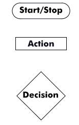
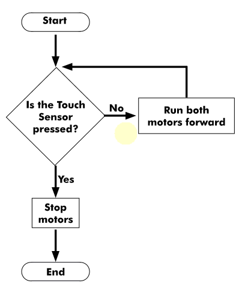
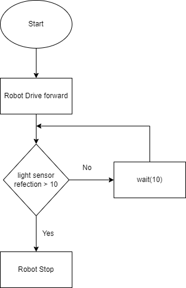

Flowcharts are a visual representation of program flow. A flowchart normally uses 
a combination of blocks and arrows to represent actions and sequence. Blocks typically 
represent actions. The order in which actions occur is shown using arrows that point from 
statement to statement. Sometimes a block will have multiple arrows coming out of it, 
representing a step where a decision must be made about which path to follow. 



<--->
**Start** and **End** symbols are represented as rounded rectangles, 
usually containing the word "Star" or "End", but can be more 
specific such as "Power Robot Off" or "Stop All Motors". 

**Actions** are represented as rectangles and act as basic 
commands. Examples: 
	wait(10)
	increment LineCount by 1
	motors full ahead

**Decision** blocks are represented as diamonds. These typically 
contain Yes/No questions. Decision blocks have two or more 
arrows coming Out Of them, representing the different paths that 
can be followed, depending on the outcome Of the decision. 
The arrows should always be labelled accordingly. 



## Example Flowchart

The following flowchart instructs a robot to run forward as long as its touch sensor is not pressed. When the touch sensor is pressed the motors stop and the program ends. 
<--->


## Example Flowchart

The following flowchart instructs a robot to run forward as long as its color sensor reflected light is less than 10%. When the color sensor reflected light is greater than 10% the robot will stop. 
<--->


